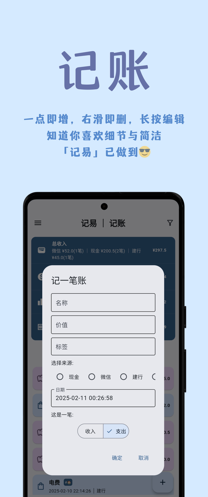
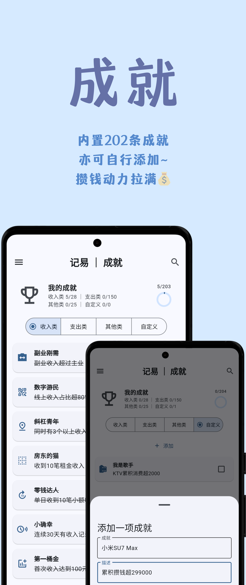
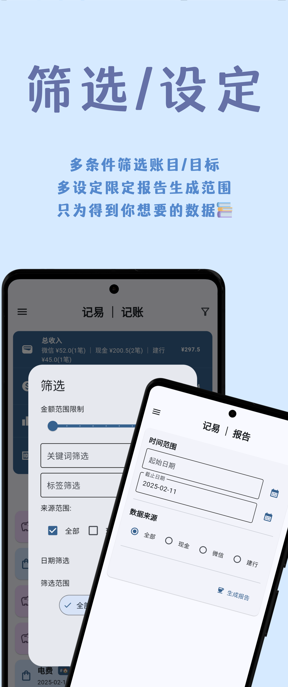
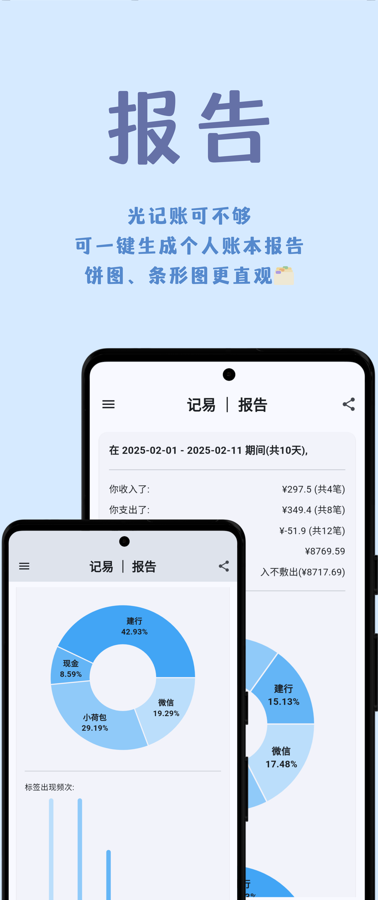
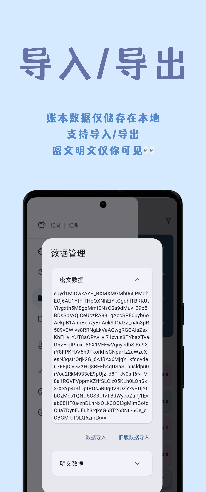

# 记易: 让记账更容易!

> 一个`Material Design 3`的本地账本应用, 支持账目的`增添删改查`与数据的`导出 / 导入`, 带有`半个成就系统`与简单的`分析功能`, 支持`从微信 / 支付宝等平台`导入账单csv文件, 亦可自行编写规则插件(几行便可完成). 使用`flet`构建(全平台支持).

## 特点🥳

- 支持自定义主题色的`Material Design 3`;
- 使用`flet`构建, 支持全平台;
- 支持账目的增添删改查, 以及账目数据的导出/导入(明文/密文);
- 带有半个成就系统, 支持自定义成就;
- 简单的分析功能(`饼图`与`条形图`);
- 多平台导入, 几行就能编写新插件;
- ......

## 截图📸

<p align="center">
  
  
  
  <br>
  
  
  
  <br>
  
  
  
</p>


## 使用 & 帮助💡

[release](/release)中仅发布了本地编译的apk文件, 后续学习一下actions就能发布其它平台的安装包啦!

帮助请见[帮助文档](/HELP.md).

## 问题💭

1. 我该如何获得各平台的csv文件?
   - 微信: 服务 > 钱包 > 账单 > 常见问题 > 下载账单
   - 其他平台也都差不多, 目前记易仅支持了csv导入(因为python内置了csv库, 可以减小包的质量)

2. 我在使用过程中发现bug怎么办?
   - 这是我第一次用flet开发应用, 过程中难免有疏忽之处(中间已经重构一次了🌚). 如果发现bug, 请提交issue, 我会尽快修复的!!!

3. 我有好想法💡
   - 欢迎PR或issue😘!!!

## 开发🔧

本地构建:
```sh
git clone https://github.com/wzk0/jiyi # clone仓库.

pip3 install flet[all] --break-system-packages # 安装flet.

flet build # 构建, 可以选择平台参数, 详见flet官网.
```

记易的程序存放在`jiyi/main.py`与`jiyi/tool/tool.py`中, 目前还没什么注释, 但遵从响应式UI的设计理念: 即用户操作改变UI.

由于我只有Linux和安卓设备, 其他平台并没有做测试, 且UI设计主要以安卓为主, 一些UI可能会不合适.

## 致谢💖

[flet](https://flet.dev)

[flet中文网](https://flet.qiannianlu.com/)